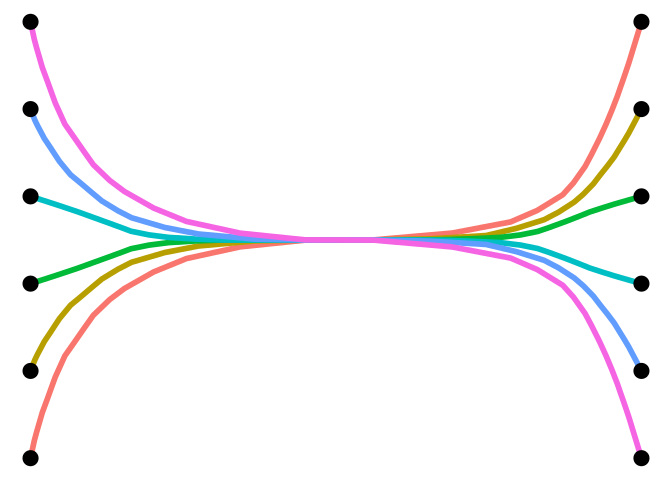
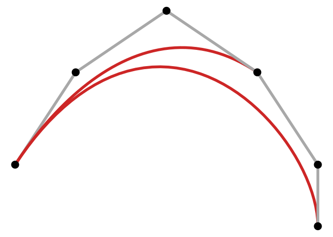
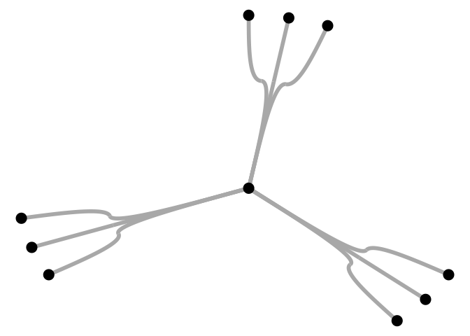
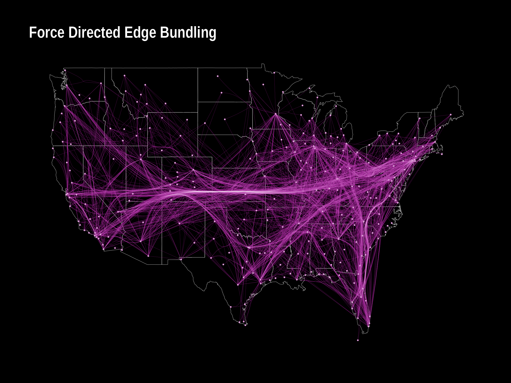
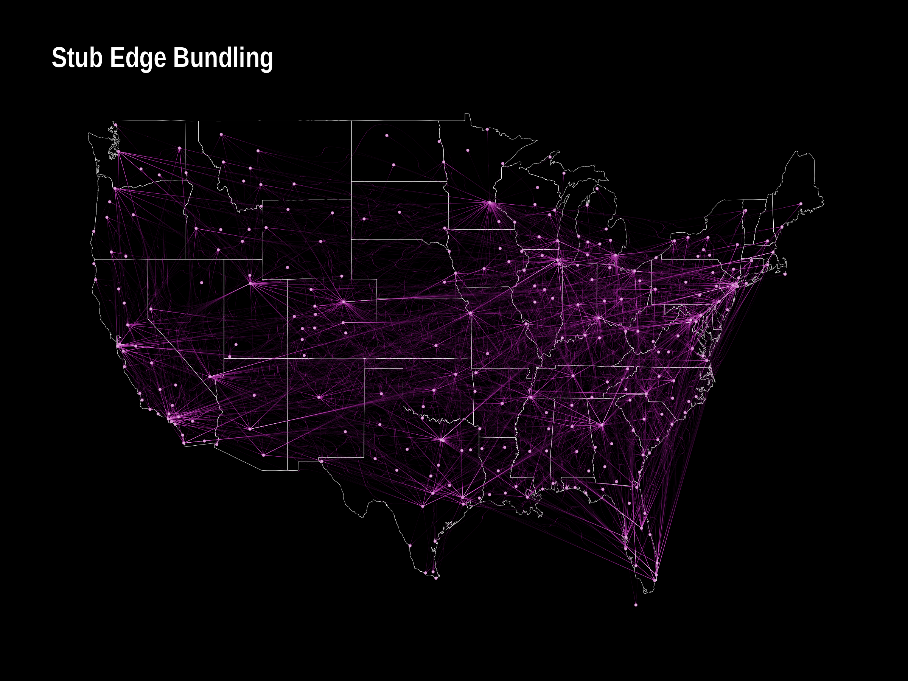
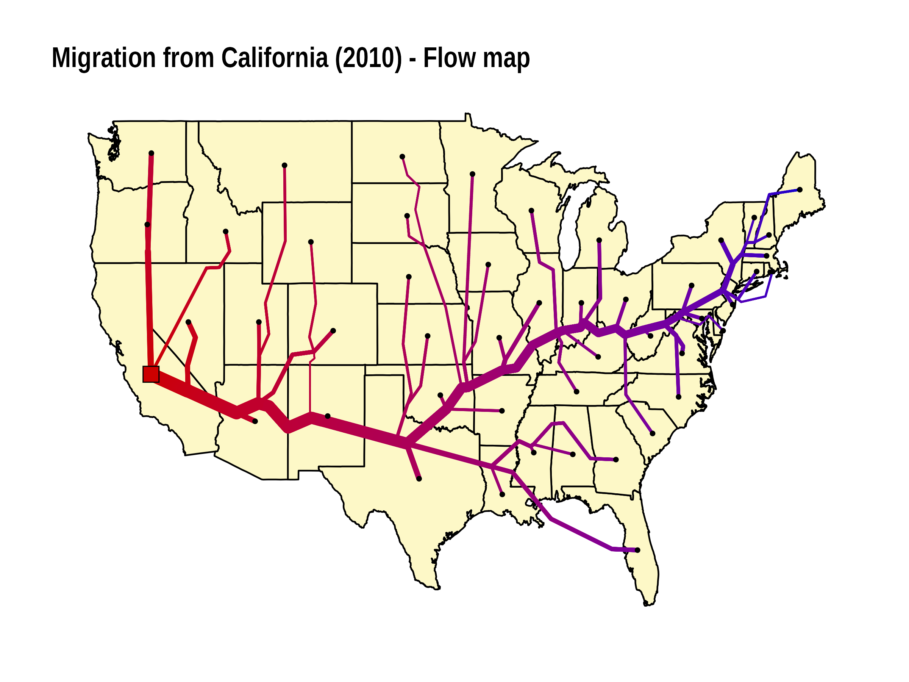
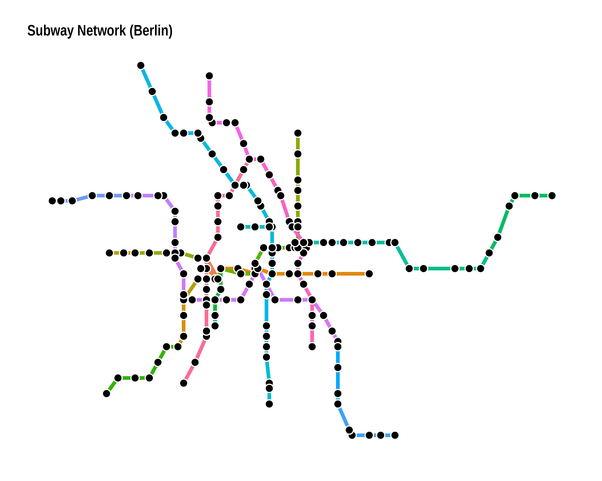

<!-- README.md is generated from README.Rmd. Please edit that file -->

# edgebundle 

<!-- badges: start -->

[](https://github.com/schochastics/edgebundle/actions)
[](https://CRAN.R-project.org/package=edgebundle)
[](https://CRAN.R-project.org/package=edgebundle)
<!-- badges: end -->

An R package that implements several edge bundling/flow and metro map
algorithms. So far it includes

- Force directed edge bundling
- Stub bundling
  ([paper](https://www.uni-konstanz.de/mmsp/pubsys/publishedFiles/NoBr13.pdf))
- Hammer bundling ([python
  code](https://datashader.org/_modules/datashader/bundling.html))
- Edge-path bundling ([paper](https://arxiv.org/abs/2108.05467))
- TNSS flow map ([paper](https://doi.org/10.1080/15230406.2018.1437359))
- Multicriteria Metro map layout
  ([paper](https://doi.org/10.1109/TVCG.2010.24))

(The API is not very opinionated yet and may change in future releases.)

## Installation

The package is available on CRAN.

``` r
install.packages("edgebundle")
```

The developer version can be installed with

``` r
# install.packages("remotes")
remotes::install_github("schochastics/edgebundle")
```

Note that `edgebundle` imports `reticulate` and uses a pretty big python
library (datashader).

``` r
library(edgebundle)
library(igraph)
```

## Edge bundling

The expected input of each edge bundling function is a graph
(igraph/network or tbl_graph object) and a node layout.  
All functions return a data frame of points along the edges of the
network that can be plotted with {{ggplot2}} using `geom_path()` or
`geom_bezier()` for `edge_bundle_stub()`.

``` r
library(igraph)
g <- graph_from_edgelist(
  matrix(c(1,12,2,11,3,10,4,9,5,8,6,7),ncol=2,byrow = T),F)
xy <- cbind(c(rep(0,6),rep(1,6)),c(1:6,1:6))

fbundle <- edge_bundle_force(g,xy,compatibility_threshold = 0.1)
head(fbundle)
#>            x       y     index group
#> 1 0.00000000 1.00000 0.0000000     1
#> 2 0.00611816 1.19977 0.0303030     1
#> 3 0.00987237 1.29767 0.0606061     1
#> 4 0.01929293 1.52427 0.0909091     1
#> 5 0.02790686 1.68643 0.1212121     1
#> 6 0.03440142 1.81285 0.1515152     1
```

The result can be visualized as follows.

``` r
library(ggplot2)

ggplot(fbundle) +
  geom_path(aes(x, y, group = group, col = as.factor(group)), 
            size = 2, show.legend = FALSE) +
  geom_point(data = as.data.frame(xy), aes(V1, V2), size = 5) +
  theme_void()
```



``` r

# simple edge-path bundling example
g <- graph_from_edgelist(matrix(c(1, 2, 1, 6, 1, 4, 2, 3, 3, 4, 4, 5, 5, 6), 
                                ncol = 2, byrow = TRUE), FALSE)
xy <- cbind(c(0, 10, 25, 40, 50, 50), c(0, 15, 25, 15, 0, -10))
res <- edge_bundle_path(g, xy, max_distortion = 2, weight_fac = 2, segments = 50)

ggplot() +
  geom_path(data = res, aes(x, y, group = group, col = as.factor(group)), 
            size = 2, show.legend = FALSE) +
  geom_point(data = as.data.frame(xy), aes(V1, V2), size = 5) +
  scale_color_manual(values = c("grey66", "firebrick3", "firebrick3", rep("grey66", 4))) +
  theme_void()
```



For `edge_bundle_stub()`, you need `geom_bezier()` from the package
{{ggforce}}.

``` r
library(ggforce)
g <- graph.star(10, "undirected")

xy <- matrix(c(
  0, 0,
  cos(90 * pi / 180), sin(90 * pi / 180),
  cos(80 * pi / 180), sin(80 * pi / 180),
  cos(70 * pi / 180), sin(70 * pi / 180),
  cos(330 * pi / 180), sin(330 * pi / 180),
  cos(320 * pi / 180), sin(320 * pi / 180),
  cos(310 * pi / 180), sin(310 * pi / 180),
  cos(210 * pi / 180), sin(210 * pi / 180),
  cos(200 * pi / 180), sin(200 * pi / 180),
  cos(190 * pi / 180), sin(190 * pi / 180)
), ncol = 2, byrow = TRUE)

sbundle <- edge_bundle_stub(g, xy, beta = 90)

ggplot(sbundle) +
  geom_bezier(aes(x, y, group = group), size = 1.5, col = "grey66") +
  geom_point(data = as.data.frame(xy), aes(V1, V2), size = 5) +
  theme_void()
```



The typical edge bundling benchmark uses a dataset on us flights, which
is included in the package.

``` r
g <- us_flights
xy <- cbind(V(g)$longitude, V(g)$latitude)
verts <- data.frame(x = V(g)$longitude, y = V(g)$latitude)

fbundle <- edge_bundle_force(g, xy, compatibility_threshold = 0.6)
sbundle <- edge_bundle_stub(g, xy)
hbundle <- edge_bundle_hammer(g, xy, bw = 0.7, decay = 0.5)
pbundle <- edge_bundle_path(g, xy, max_distortion = 12, weight_fac = 2, segments = 50)

states <- map_data("state")


p1 <- ggplot() +
  geom_polygon(data = states, aes(long, lat, group = group), 
               col = "white", size = 0.1, fill = NA) +
  geom_path(data = fbundle, aes(x, y, group = group), 
            col = "#9d0191", size = 0.05) +
  geom_path(data = fbundle, aes(x, y, group = group), 
            col = "white", size = 0.005) +
  geom_point(data = verts, aes(x, y), 
             col = "#9d0191", size = 0.25) +
  geom_point(data = verts, aes(x, y), 
             col = "white", size = 0.25, alpha = 0.5) +
  geom_point(data = verts[verts$name != "", ], 
             aes(x, y), col = "white", size = 3, alpha = 1) +
  labs(title = "Force Directed Edge Bundling") +
  ggraph::theme_graph(background = "black") +
  theme(plot.title = element_text(color = "white"))

p2 <- ggplot() +
  geom_polygon(data = states, aes(long, lat, group = group), 
               col = "white", size = 0.1, fill = NA) +
  geom_path(data = hbundle, aes(x, y, group = group), 
            col = "#9d0191", size = 0.05) +
  geom_path(data = hbundle, aes(x, y, group = group), 
            col = "white", size = 0.005) +
  geom_point(data = verts, aes(x, y), 
             col = "#9d0191", size = 0.25) +
  geom_point(data = verts, aes(x, y), 
             col = "white", size = 0.25, alpha = 0.5) +
  geom_point(data = verts[verts$name != "", ], aes(x, y), 
             col = "white", size = 3, alpha = 1) +
  labs(title = "Hammer Edge Bundling") +
  ggraph::theme_graph(background = "black") +
  theme(plot.title = element_text(color = "white"))

alpha_fct <- function(x, b = 0.01, p = 5, n = 20) {
  (1 - b) * (2 / (n - 1))^p * abs(x - (n - 1) / 2)^p + b
}

p3 <- ggplot() +
  geom_polygon(data = states, aes(long, lat, group = group), 
               col = "white", size = 0.1, fill = NA) +
  ggforce::geom_bezier(
    data = sbundle, aes(x, y,
      group = group,
      alpha = alpha_fct(..index.. * 20)
    ), n = 20,
    col = "#9d0191", size = 0.1, show.legend = FALSE
  ) +
  ggforce::geom_bezier(
    data = sbundle, aes(x, y,
      group = group,
      alpha = alpha_fct(..index.. * 20)
    ), n = 20,
    col = "white", size = 0.01, show.legend = FALSE
  ) +
  geom_point(data = verts, aes(x, y), 
             col = "#9d0191", size = 0.25) +
  geom_point(data = verts, aes(x, y), 
             col = "white", size = 0.25, alpha = 0.5) +
  geom_point(data = verts[verts$name != "", ], aes(x, y), 
             col = "white", size = 3, alpha = 1) +
  labs(title = "Stub Edge Bundling") +
  ggraph::theme_graph(background = "black") +
  theme(plot.title = element_text(color = "white"))

p4 <- ggplot() +
  geom_polygon(data = states, aes(long, lat, group = group), 
               col = "white", size = 0.1, fill = NA) +
  geom_path(data = pbundle, aes(x, y, group = group), 
            col = "#9d0191", size = 0.05) +
  geom_path(data = pbundle, aes(x, y, group = group), 
            col = "white", size = 0.005) +
  geom_point(data = verts, aes(x, y), 
             col = "#9d0191", size = 0.25) +
  geom_point(data = verts, aes(x, y), 
             col = "white", size = 0.25, alpha = 0.5) +
  geom_point(data = verts[verts$name != "", ], aes(x, y), 
             col = "white", size = 3, alpha = 1) +
  labs(title = "Edge-Path Bundling") +
  ggraph::theme_graph(background = "black") +
  theme(plot.title = element_text(color = "white"))

p1
p2
p3
p4
```



## Flow maps

A flow map is a type of thematic map that represent movements. It may
thus be considered a hybrid of a map and a flow diagram. The package so
far implements a spatial one-to-many flow layout algorithm using
triangulation and approximate Steiner trees.

The function `tnss_tree()` expects a one-to-many flow network (i.e. a
weighted star graph), a layout for the nodes and a set of dummy nodes
created with `tnss_dummies()`.

``` r
library(ggraph)
xy <- cbind(state.center$x,state.center$y)[!state.name%in%c("Alaska","Hawaii"),]
xy_dummy <- tnss_dummies(xy,4)
gtree <- tnss_tree(cali2010,xy,xy_dummy,4,gamma = 0.9)

ggraph(gtree,"manual",x=V(gtree)$x,y=V(gtree)$y)+
  geom_polygon(data=us,aes(long,lat,group=group),fill="#FDF8C7",col="black")+
  geom_edge_link(aes(width=flow,col=sqrt((xy[root,1]-..x..)^2 + (xy[root,2]-..y..)^2)),
                 lineend = "round",show.legend = FALSE)+
  scale_edge_width(range=c(0.5,4),trans="sqrt")+
  scale_edge_color_gradient(low="#cc0000",high = "#0000cc")+
  geom_node_point(aes(filter=tnss=="leaf"),size=1)+
  geom_node_point(aes(filter=(name=="California")),size=5,shape=22,fill="#cc0000")+
  theme_graph()+
  labs(title="Migration from California (2010) - Flow map")
```



To smooth the tree, use `tnss_smooth()`. Note that this changes the
object type and you need to visualize it with {{ggplot2}} rather than
{{ggraph}}.

``` r
smooth_df <- tnss_smooth(gtree,bw=5,n=20)

ggplot()+
  geom_polygon(data=us,aes(long,lat,group=group),fill="#FDF8C7",col="black")+
  geom_path(data = smooth_df,aes(x,y,group=destination,size=flow),
            lineend = "round",col="firebrick3",alpha=1)+
  theme_void()+
  scale_size(range=c(0.5,3),guide = "none")+
  labs(title="Migration from California (2010) - Flow map smoothed")
```


See [this gallery](http://minard.schochastics.net/) for more examples
and code.

## Metro Maps

Metro map(-like) graph drawing follow certain rules, such as octilinear
edges. The algorithm implemented in the packages uses hill-climbing to
optimize several features desired in a metro map. The package includes
the metro map of Berlin as an example.

``` r

# the algorithm has problems with parallel edges
g <- simplify(metro_berlin)
xy <- cbind(V(g)$lon,V(g)$lat)*100

# the algorithm is not very stable. try playing with the parameters
xy_new <- metro_multicriteria(g,xy,l = 2,gr = 0.5,w = c(100,100,1,1,100),bsize = 35)

# geographic layout
ggraph(metro_berlin,"manual",x=xy[,1],y=xy[,2])+
  geom_edge_link0(aes(col=route_I_counts),edge_width=2,show.legend = FALSE)+
  geom_node_point(shape=21,col="white",fill="black",size=3,stroke=0.5)

#schematic layout
ggraph(metro_berlin,"manual",x=xy_new[,1],y=xy_new[,2])+
  geom_edge_link0(aes(col=route_I_counts),edge_width=2,show.legend = FALSE)+
  geom_node_point(shape=21,col="white",fill="black",size=3,stroke=0.5)+
  theme_graph()+
  labs(title = "Subway Network Berlin")
```



## Disclaimer

Edge bundling is able to produce neat looking network visualizations.
However, they do not necessarily enhance readability. After
experimenting with several methods, it became quite evident that the
algorithms are very sensitive to the parameter settings (and often
really only work in the showcase examples…). Consult the original
literature (if they even provide any guidelines) or experiment yourself
and **do not expect any miracles**.
